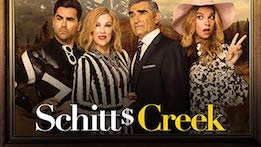
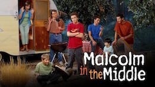
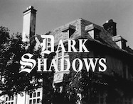

# Anita's TV is Worth Watching
Hi Friends,
This week I want to share what I've been watching lately, but this week I'm doing it in **GFM Markdown**. As many of you know, the last few months have been difficult *(to say the least)*, so what better way to destress than with some good screen viewing.

Is your :dog: hungry? Did the :cow: jump over the moon? Don't worry, be happy!! :smiley: :whale:

## What I've Been Watching Lately
* *Schitt's Creek*
* *Miranda*
* *Malcolm in the Middle*
 * let's see what one space does.
 * it doesn't really matter how many spaces.
* *Dark Shadows*

## Why I'm Enjoying These Shows
1. They make me laugh.
1. Great characters.
1. Fun storylines; not too heavy.
1. I love to laugh out loud.
   1. this is another item
   1. I just spaced over a few spaces. Neat.

Show | Genre | Where to Watch
----------------|---------------|---------------
Schitt's Creek| Comedy | Netflix
Miranda| Comedy|Hulu
Malcolm in the Middle|Comedy|Hulu
Dark Shadows|Soap Opera|Amazon Prime

## About the Shows

Well that was fun. Use the `<a href>` tag to put the link in. That's fine. **_Now I'll fool with_** a column for a few minutes, then move on to a new "portfolio" type document instead of my tv watching.

As Eugene Pallette said in *My Man Godfrey*:
> *All you need for an asylum is an empty room and the right kind of people.*

:cat: Kitty says, "Hi"

## More Shows to Watch
* Kominsky Method
* ~Outlander~
* Living with Yourself
 * this stars Paul Rudd
 * .. and Paul Rudd
* Grace and Frankie

<a href="https://www.nationalninja.com/"><button>ninja me</button></a>

Click here for the [w3schools website](https://www.w3schools.com/) and then click here for [some silly images](https://www.google.com/search?sxsrf=ALeKk01ML1K6-0FLO13n7tjjk3ODuVxDgQ:1582921371934&q=silly&tbm=isch&source=univ&client=firefox-b-1-d&sa=X&ved=2ahUKEwinhNPQifXnAhVLRxUIHQ8tAqkQsAR6BAgKEAE&biw=1159&bih=609a).

My checklist for the week:
- [x] Homework
- [ ] Portfolio
 - [ ] Ponder a "theme" for all pieces
 - [ ] Revise or create new tour, html, and markdown
