# Audio File Cropping in Praat

## Introduction

Praat is a free, open-source specialty audio software popular with speech-language pathologists, audiologists, academic linguists, and others whose work requires the deconstruction and analysis of principal components of natural speech signals. It was first introduced by researchers at the University of Amsterdam in 1991. The word "praat" means "to talk" in Dutch. While it is possible to record audio files directly within Praat, most clinical and academic professional users will first record speech files in an optimized sound mixing software commonly used in other professional sound recording studios. Recommended audio recording files for those interested in the highest quality sound files for analysis include the following:

- Audacity
- Logic Pro
- Sound Forge
- Adobe Audition
- Avid ProTools
- Cakewalk by BandLab

Sound files recorded in one of these professional, licensed platforms can be directly read by Praat. However, academic and clinical users typically wish to analyze speech spectrograms over very short timescales of five to twenty seconds at a time, i.e. the timespan it takes to speak one natural-length sentence. The table below provides a sampling of some of the most common analytical uses of Praat. 

Table:
Analysis Type | Brief Description of Analysis Type
---|---
Acoustic Labeling | Acoustic cues are those observable patterns in speech that provide interpretable information to the listener not related to the speech itself. For example, a rising pitch at the end of a sentence is typically associated with a statement of uncertainty or a question. They are reflected in amplitude differences across different phonemes, words, and sentences. 
Formant Analysis | Formants are distinct peaks in the frequency spectrum of a sound. They represent the resonant frequencies of the vocal tract while speaking. These resonant frequencies differ both by speaker and by part of speech. They are critical for defining what is known as the vowel space - or characteristic set of frequencies - that enable listeners to distinguish vowels and consonants or different vowels from each other.
Phonemic Labeling | This represents labeling each individual phone or part of speech. In linguistics, this is typically done using the International Phonemic Alphabet, which is built into Praat as a default character set. Linguists use this labeling to capture, for instance the differences in same-vowel production between a Midwestern speaker who might pronounce a word like 'can' with an over-emphasis on the nasal final n, or a native Northeasterner who might pronounce Harvard dropping the 'r' to sound like 'Hahvad' 'Yahd.'

The first step in all of these analyses, however, is typically to input a stereo sound file into Praat and separate out background noise and any instructions given to the speaker during recording - or any other background noise - from the main speech signal. Researchers also do not typically want to work with a potentially hour-long speech file when they intend to analyze only ten seconds of raw speech. The instructions below provide a simple, step-by-step guide to how to extract single sentences from a larger speech file and save them as individual mono .wav files for later in-depth analyses. In this example, a single sentence is extracted. The procedure is the same for any unit of analysis from individual phoneme to entire passages such as the common [Rainbow Passage](https://www.york.ac.uk/media/languageandlinguistics/documents/currentstudents/linguisticsresources/Standardised-reading.pdf) used in many speech protocols.

## Extracting a sentence

To extract a single sentence from a large speech file in Praat, use the following steps below. Illustrations are provided for each step.

1. Open Praat 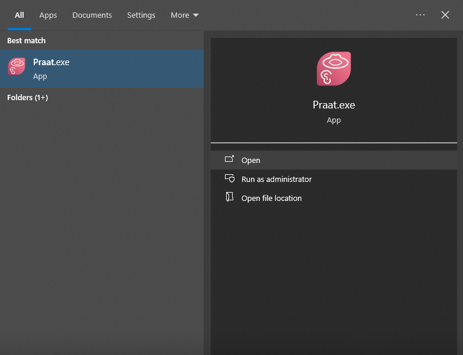
1. Read stereo file from folder 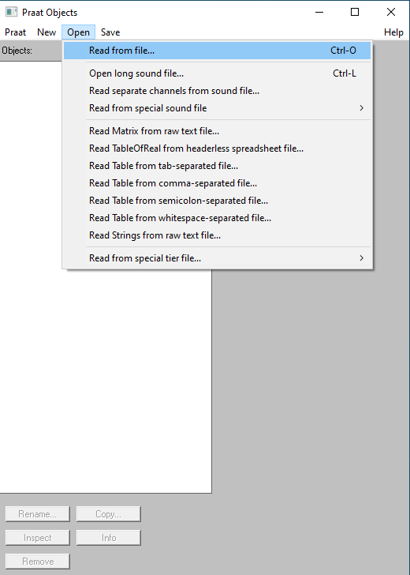 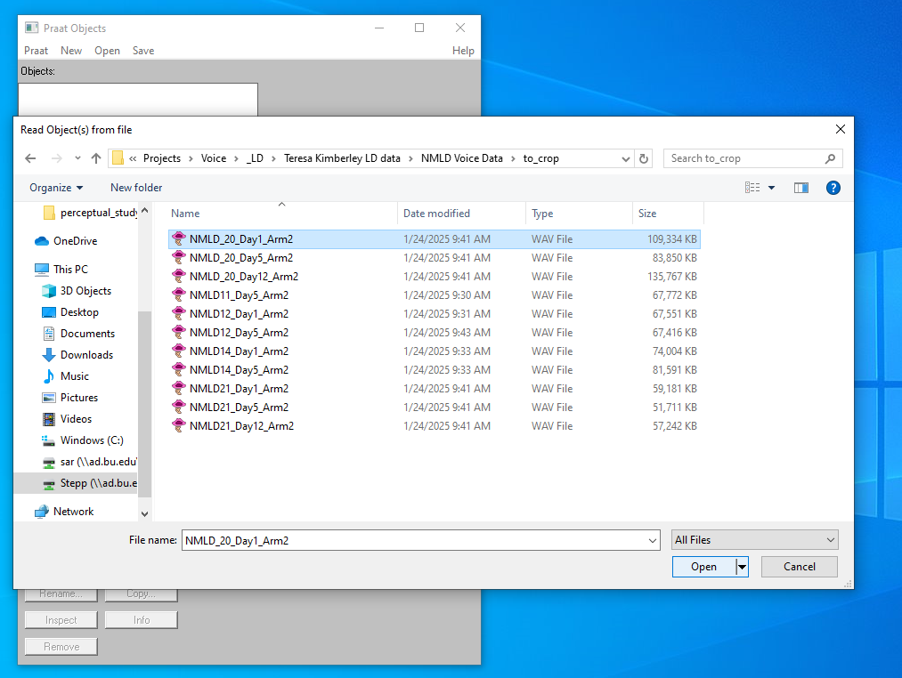
1. Click convert. Select ‘convert to mono’ from drop down menu. 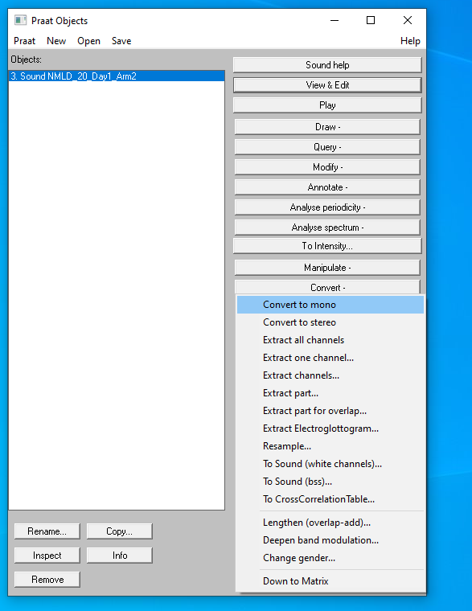
1. Click ‘view and edit’ 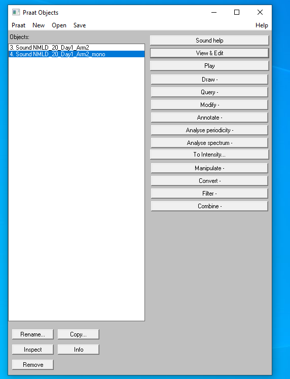
1. Estimate where the first sentence you want to find is in the resulting spectrogram and click into the overall recording at your best estimate where the sentence starts 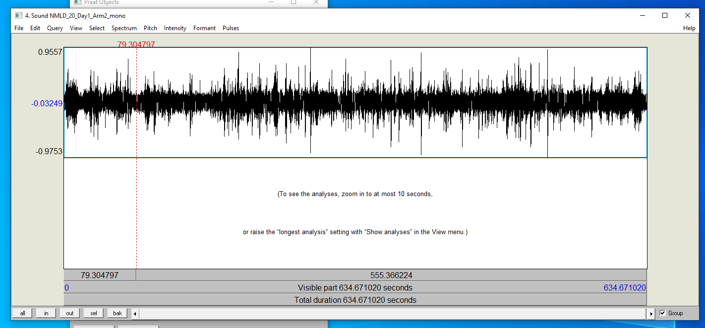
1. Click the resulting segment and repeat this process until you triangulate. 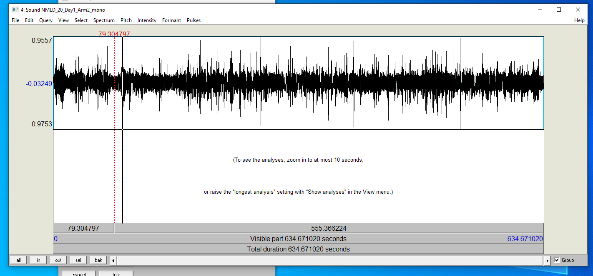
1. Right click and drag the portion before or after you want to crop 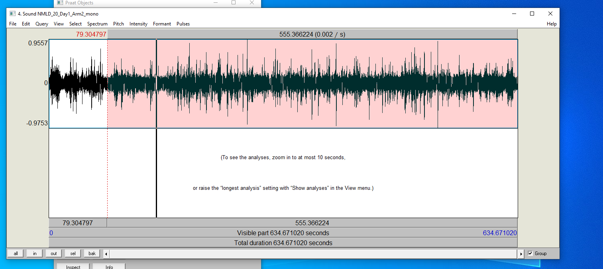
1. Click CTRL-X to delete
1. Repeat this again on each smaller resulting segment 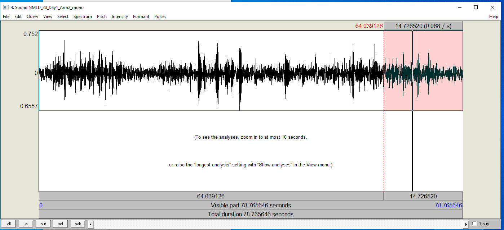
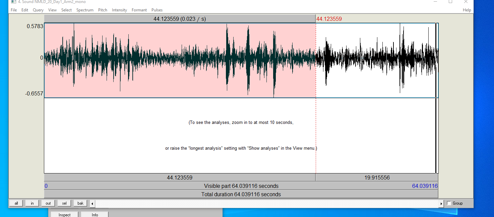
1. Click to play the visible part and confirm only the resulting sentences are there. 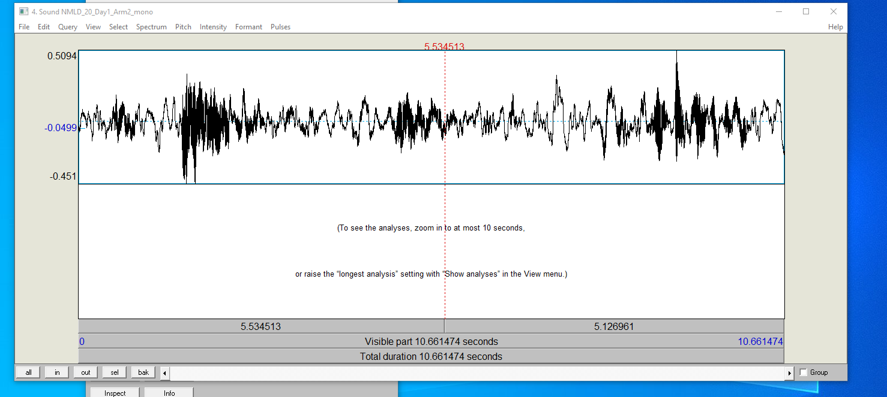
> [!TIP]
> leave spaces in between sentences for easier and more seamless snipping!
1.  Save your file as a .wav form 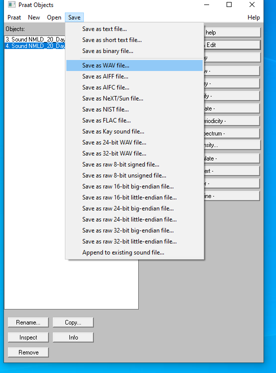
