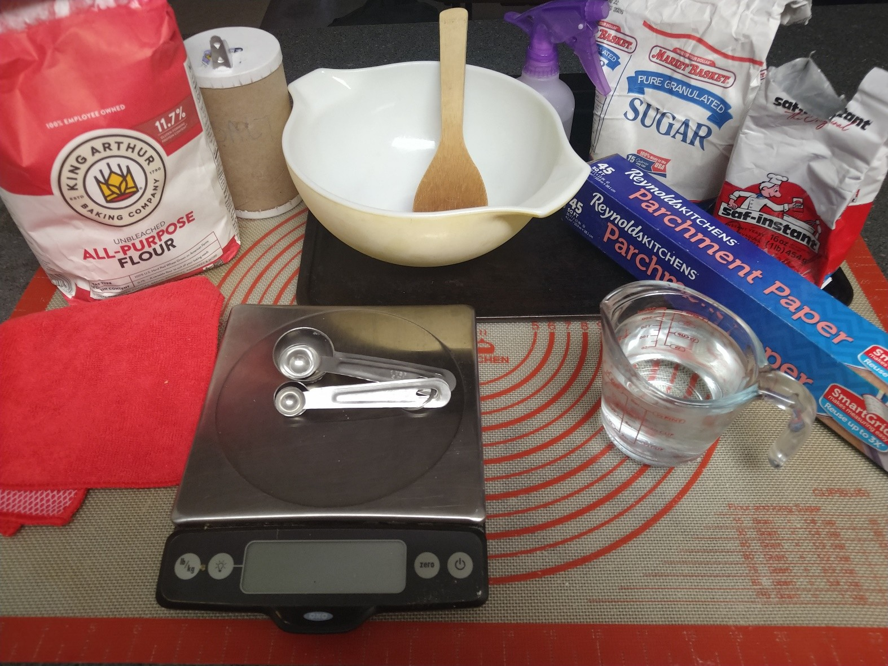
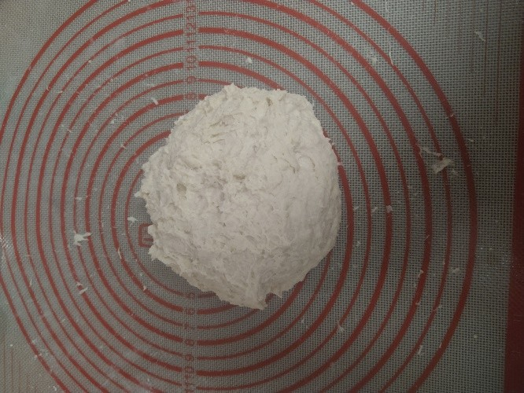
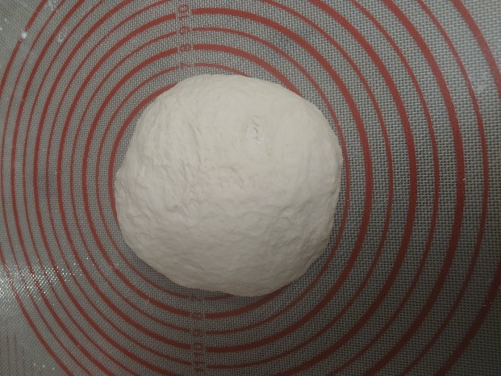
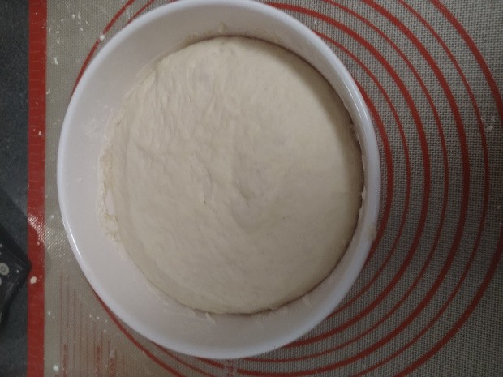
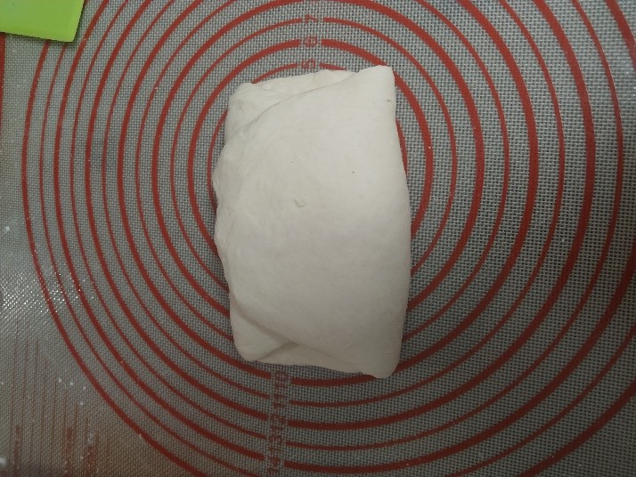
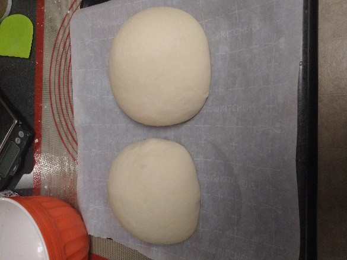
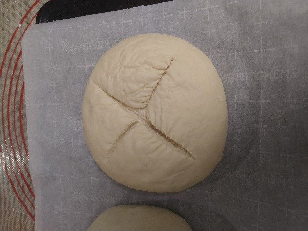
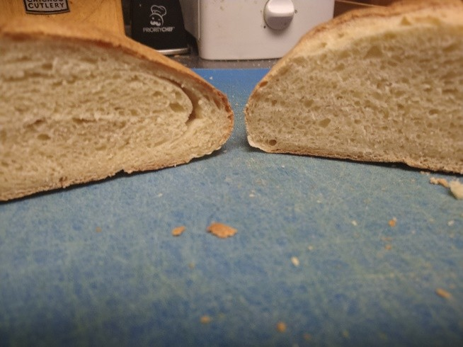

# UNDERSTANDING HOW TO BAKE BASIC BREAD
### BY ROBERT PALMER

{:toc}

## Basic Ingredients

There are four primary ingredients involved in making a good loaf of fresh bread: __flour, water, salt, and yeast.__ Flour provides structure by forming gluten networks, which captures steam and leavening gases to create the texture of the bread (also called the crumb). Water hydrates the proteins in flour to form gluten, hydrates yeast, provides moistness to the texture, and steam to add volume and brown the crust. Yeast ferments the dough, adding flavor and creating carbon dioxide that causes it to rise. Salt enhances flavor, strengthens gluten, regulates fermentation and acts as a preservative to keep the bread fresher longer. While technically salt can be omitted it leaves the finished loaf bland and pale.

Sugar is commonly added as a fifth ingredient to bread, but is not necessary for a good finished loaf. Generally, a small amount of sugar is added to a recipe to greatly decrease fermentation times, although this can come at the expense of the more complex flavors developed by long rise times. Larger amounts of sugar add a sweet flavor, change the texture of the bread to be softer and lighter, and have a preservative effect.

## Protein, Hydration, and Texture

The texture of bread can vary greatly, from a sturdy sandwich loaf to airy and open Pan de Cristal. The two primary determining ingredients for texture in a basic loaf are the protein content of the flour and the hydration level of the dough. 
Common flour protein typically varies between about 7% for cake flour up to 14% for high gluten bread flours. More protein creates more gluten in the dough, which can either create a tougher, chewy loaf or provide the structure for an open, Swiss cheese like artisan loaf. Less protein makes for a softer more tender bread, like cakes. ‘Bread flour’ sits on the high end of protein content and can be too tough for a basic loaf. All Purpose (AP) flour is preferable for most basic loaves.

Hydration affects the texture of the loaf through the consistency of the dough and the generation of steam during the baking process. A dough with high hydration will have a very thin consistency, close to pancake batter at the extreme, and will require different kneading methods than a standard loaf. The result will be a softer, more open crumb and will most likely require a high protein flour to create enough structure to rise. On the opposite end a low hydration dough will be stiff and hard to work, and the resulting load will be very dense.

There are other factors that can affect final bread crumb, such as adding fats and oils to coat and soften the gluten or adjusting the fermentation time.

## Baker’s Math
Proportions of ingredients are the secret to baking. Adding an extra cup of water to a recipe can have a drastic effect on both the techniques required to create a loaf and the crumb of the finished loaf. Not including enough salt can make an otherwise beautiful loaf unappetizing. Scaling a recipe is made much easier through baker’s math, also called baker’s percentage. Understanding proportions is how a baker goes from merely copying a recipe to creating their own.

1. __Weigh your ingredients:__ Using measurements of volume, like cups, will yield inexact results. A compacted cup of flour weighs much more than one with the flour spooned in!

1. __Flour is the base:__ all other ingredients are expressed as a percentage of the weight of the flour in the recipe. This means that flour is always listed as 100%.

1. __Add all sources of hydration together:__ In more complicated recipes ingredients like whole milk (88% water), butter (18% water), or whole eggs (76% water) all provide hydration to the dough and will affect the final texture.

1. __Calculate percentages:__ All other ingredients are listed as a proportion of the weight of the flour. Percentage = (Weight of Ingredient/Weight of Flour) × 100. A recipe with 600 grams of flour and 12 grams of salt would have (12g/600g) x 100 = 2% salt

## Demonstrating a Basic Recipe
The recipe for this basic loaf of bread, which will make two loaves, expressed using baker’s percentages along with the weight and volume is

Ingredient | Baker’s Percentage | Weight | Volume
---|---|---|---
All Purpose Flour | 100% | 600g | 5 cups
Water | 70% | 420g | 1.75 cups
Salt | 2% | 12g | 2 teaspoons
Active Dry Yeast | 1% | 6g | 2 teaspoons / 1 packet
Granulated Sugar | 2% | 12g | 1 Tablespoon

This recipe can be easily scaled using the percentages. For instance, if instead you wanted to make just one loaf you could take 300g of flour as the base and adjust all of the values from there.
All Purpose flour and 70% hydration will produce an average loaf, with a mostly closed crumb suitable for covering in butter and jam or making sandwiches without being too chewy. The dough will be firm and easy to work with when kneading. The salt and yeast percentages are the same across most bread recipes. The addition of a small amount of sugar will result in a total rise time of about two hours, depending on the room temperature.

## Making the Dough
Gather up all your ingredients and tools before you start

 
- 600g All Purpose Flour (5 cups)
- extra flour for working the dough (1/4 cup)
- 420g warm (100°F-110°F) water (1.75 cups)
- 12g salt (2 tsp)
- 6g Active Dry Yeast (2 tsp / 1 packet)
- 12g granulated sugar (1 tbsp)
- large mixing bowl
- large spoon
- clean dish cloth or plastic wrap
- baking sheet
- a sharp knife
- parchment paper or cornmeal (optional)
- spray bottle of water (optional)

It is preferable to weight out your ingredients using a scale, if possible, to ensure accurate measurements. This is especially important for flour, because a ‘cup’ of flour can vary greatly in weight depending on how compacted the flour is. If you don’t have a scale then spoon the flour into a measuring cup until it is level rather than scooping the flour out directly.

The exact temperature of the water is not as important as the water not being so hot as to kill the yeast before they can do their job. Use water that feels warm but not hot, and its better to have water that is slightly too cool than too hot. Cool water will increase the amount of time it takes the yeast to wake up, but they will eventually wake up. Yeast are living creatures, be kind to them - *at least until they go in the oven.*
1. Thoroughly mix together the flour, salt, sugar, and yeast in the mixing bowl.
1. Add the warm water and mix until a rough dough comes together.
1. Sprinkle a light dusting of flour on a clean, hard work surface and turn out the rough dough from the mixing bowl onto it.

1. Knead the dough for about six minutes.
     1. Gently flatten the dough.
     1. Take the far edge of the dough and fold it towards you.
     1. Press down on the dough edges with the heels of your hands.
     1. Turn the dough 90 degrees.
     1. Repeat.
     1. If the dough is too sticky lightly flour your hands and re-flour the work surface. 
	 > [!Note]
	 > Be sparing with the additional flour though, a slightly sticky dough is expected.
1. The dough should be smooth and springy. If you poke it the indentation should gradually bounce back.

1. Clean out the mixing bowl, place the dough inside, and cover it with a clean dish cloth or plastic wrap to rise until roughly doubled in volume. This will take about an hour to an hour and a half at 75°F.

1. Re-flour your work surface and turn out the dough onto it.
1. Gently deflate the dough by lightly pressing it flat. Do not use excessive force.
1. Cut the dough in half to make two loaves. This is optional but one larger loaf will not rise or bake as well.
1. Shape each loaf into a rough oval.
1. Fold each loaf like a business letter.
     1. Take one short edge and fold it into the center.
     1. Take the other short edge and fold it over the first.
     1. Gently press the edges closed with the heel of your hand.
     1. Gently reshape the loaf into an oval.
	 
 
1. Place each loaf seam side down on the baking sheet. Sprinkling a small amount of cornmeal first on the baking sheet or lining it with parchment paper will help ensure the loaves don’t stick after baking.
1. Cover each loaf loosely with plastic wrap or a clean dishtowel and leave them to rise a second time for roughly an hour. They should be puffy by the end, and when poked the indentation should remain.

1. About 15 minutes before the end of the second rise preheat the oven to 450°F. This will give the oven time to come to an even temperature.
1.  Slash each loaf across the top about ½” deep with a sharp knife in an X-pattern. This will prevent the crust from constricting the rising bread in the oven, which would make the bread denser.

1. It’s not necessary, but lightly spraying each loaf with a water bottle before baking it will create a crunchier crust.
1. Put the bread in the oven for 20-25 minutes. It’s done when the crust is a golden brown and it sounds hollow when thumped. If you have a thermometer the internal temperature should be around 190 degrees F.
1. After taking the bread out of the oven, resist the urge to immediately cut into it. The bread is still cooking internally, and as it cools the steam inside will be reabsorbed by the gluten. Cutting into hot bread too early will release the heat and steam, resulting in a gummy texture that can quickly stale. Allow the bread to cool for at least 30 minutes, preferably an hour.

1. Bread can be stored wrapped or bagged at room temperature for several days before it becomes stale. Unless the environment is very humid it is unlikely to grow mold before it becomes stale. Bread can be frozen for longer storage, although it won’t taste quite as good post-freezing.
## Enjoy your bread
While this recipe makes a very basic loaf, making more complex breads is not substantially more difficult. A next step from here might be to buy a loaf pan to make uniformly shaped sandwich loaves, or a Dutch oven for better artisan style loaves. Sourdough is also a very popular next step and mostly consists of growing your own living yeast colony with flour and water. No matter what the bread recipe though, it always comes back to the basics of flour, water, salt, and yeast.
