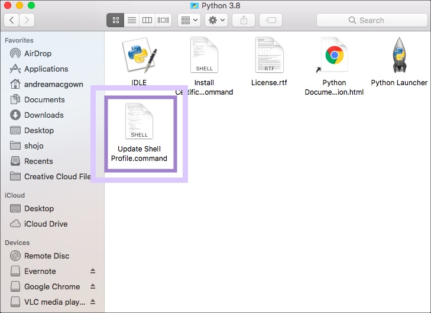
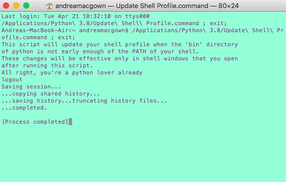
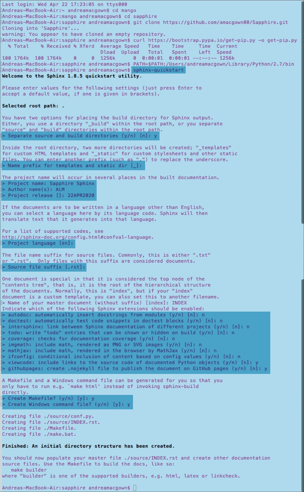

****************************
Sphinx Process for Mac Users
****************************

This process has a few different steps: 

- Open a directory and curl Pip into it 

- Download Python and establish it in the terminal's path

- Then get Sphinx

*Both Python and Pip need to be up and running to get Sphinx to work*

Step 1 - Install Python
=======================

- Here - https://www.python.org/downloads/
- Download the latest version
- Restart your computer
- Open the file where Python is downloaded
- Click the "Update Shell Profile.command

- This will add Python to your computer's commands in the Bin folder
- It will open a command line with some nice messages and reassurances that Python is there. Delete the terminal when it's finished

Step 2: Github

- I forked Mark's sphinx project  ([https://github.com/MarkHoeber/get_started_sphinx](https://github.com/MarkHoeber/get_started_sphinx)) into github
- Go into the command line and clone it
- git clone [https://github.com/amacgown00/get_started_sphinx.git](https://github.com/amacgown00/get_started_sphinx.git)

Step 3: Go to a directory you want to do everything in. I'll use my [mango] folder as an example

- Type these into the command line :
    - cd mango
    - First: curl [https://bootstrap.pypa.io/get-pip.py](https://bootstrap.pypa.io/get-pip.py) -o [get-pip.py](http://get-pip.py/)
    - PATH=$PATH:/Users/andreamacgown/Library/Python/2.7/bin (gets python as a command)
    - pip install Sphinx
- Unless you're some very lucky person who knows how to do things properly, you'll have to do this every time. I'm not sure how to add the commands to the config file

Step 4: Go to the [get_started_sphinx] folder you cloned

- Type this into the command line:
    - cd get_started_sphinx (or wherever it is)
    - make html
    - This is a test that will show if it works

Open another repo you made in Github and clone it to your local computer through the command line 

After you're sure pip and Sphinx and Python and everything is installed, type 
**[sphinx-quickstart]** into the terminal

This will ask you to do a bunch of things and will essentially open your first RST Sphinx project. 

