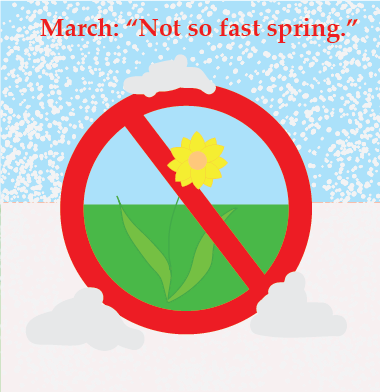

=====================
Winter's Last Stand
=====================

March
+++++

The month that will break your spirit
--------------------------------------

March. They say it's the beginning of spring, but truly, it's winter's last stand. Or at least it is in Massachusetts.

**Here's why:**

- The leaves aren't even on the trees yet.
- There's almost always snow (over eight inches during the month on average).
- It's freakin' windy—in like a lion and out like a lion.

And most relevant of all...I am writing this March 15th, we just got ten inches, and the wind is going at twenty-five miles per hour. *Ugh*.

*Just look at the average temperatures...*

+---------------+---------------+---------------+---------------+
|**City**       |**February**   |**March**      |**April**      |
+===============+===============+===============+===============+
|**Boston**     |39/24          |46/32          |56/40          |   
+---------------+---------------+---------------+---------------+
|**Worcester**  |34/18          |43/26          |54/36          |
+---------------+---------------+---------------+---------------+
Source: Wikipedia_.

.. _Wikipedia: https://en.wikipedia.org/wiki/Climate_of_Massachusetts

February's wicked cold with a couple teaser days in there, but we know it's still winter. April, not hot, but you can get away without a jacket and the days are getting long enough everything is turning green. And then there's March.

So what can you do about it?
-----------------------------

When life gives you lemons, make lemonade, especially in March because it's the only bit of warm sunshiny you're going to get.

1) Plan for it to suck. If you expect the worse and it happens, hey, you were prepared! If it doesn't happen, hey, bonus!
2) Celebrate St. Patrick's Day. It really doesn't matter a bit if you're Irish. Have you ever met a person with a drop of Irish blood who didn't want to share a drink with someone else? Well, not their drink, but drink at the same time as you. Either way, it's a fun day to celebrate.
3) Plant something in a cup and put it on your window sill. Something growing equals hope which is hard to come by in March. [*]_

	"No winter lasts forever; no spring skips its turn." -Hal Borland
	
Seriosly though...
-------------------
I love winter now even though shoveling stinks. It took me seventeen years to finally come to grips with Massachusetts winters, but up until then I was a bit cantankerous!

.. [*] This can be a double bonus if it's something to eat during the summer!

