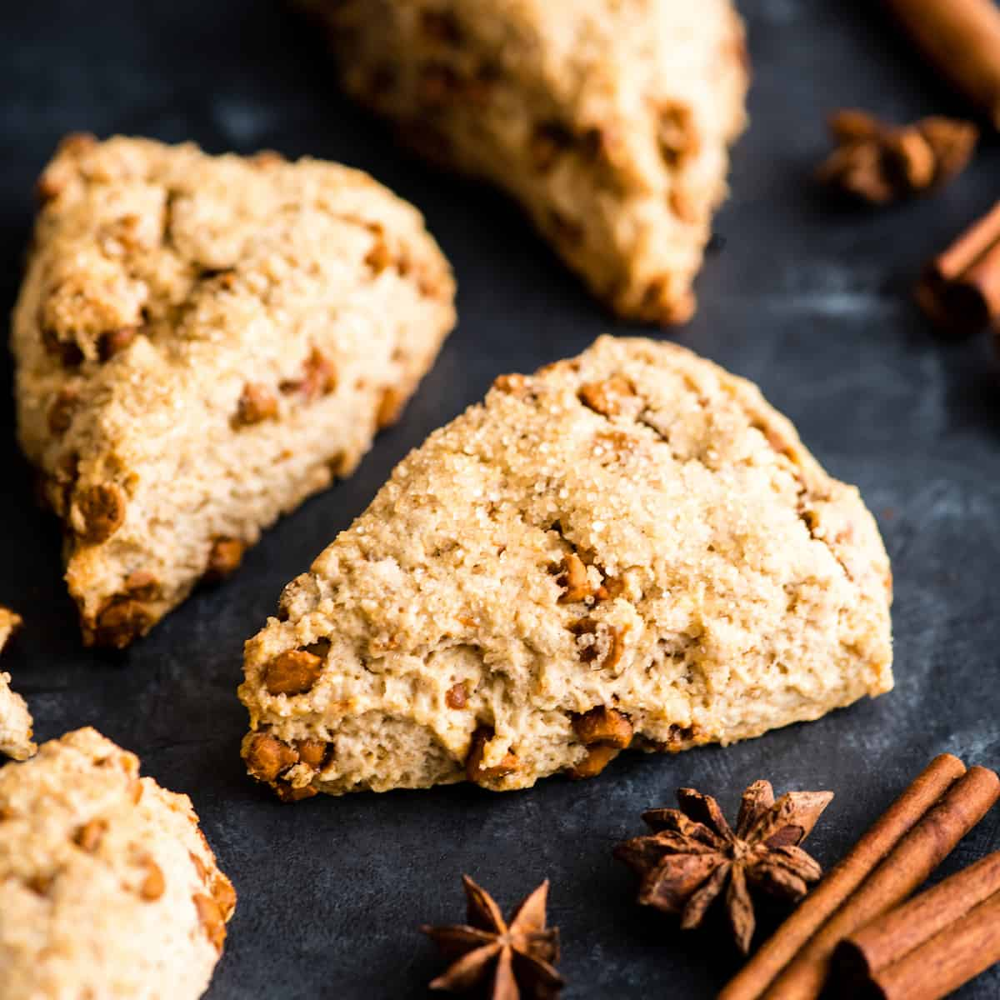

Scone Recipe
############

How to make delicious, buttery, gluten-free scones!

See `Notes` for more information about gluten free flour and how it behaves in recipes.

Equipment
=========
* Stand mixer or hand beater

.. note:: This is not necessary, but very useful to have.
  
* Large mixing bowl
* Cutting board or clean countertop
* Grater or sharp knife
* Rolling pin
* Baking sheet
* Parchment paper

Ingredients
===========
+-------------------+-------------------+
| Measurement       | Ingredient        |
+===================+===================+
| 2 cups            | Gluten free flour |
+-------------------+-------------------+
| 1/2 cup           | Light brown sugar |
+-------------------+-------------------+
| 1/2 tsp           | Salt              |
+-------------------+-------------------+
| 3 tsp             | Baking powder     |
+-------------------+-------------------+
| 1/2 tsp           | Baking soda       |
+-------------------+-------------------+
| 1/2 cup (1 stick) | Butter, frozen    |
+-------------------+-------------------+
| 1/2 cup           | Heavy cream       |
+-------------------+-------------------+
| 1 Egg             | Egg, large        |
+-------------------+-------------------+
|1 1/2 tsp          | Vanilla extract   |
+-------------------+-------------------+
| 2-3 tsp           | Cinnamon          |
+-------------------+-------------------+

Directions
==========

#. Whisk together the **flour, sugar, salt,** and **baking powder** in a large bowl.
#. Use a grate to grate the frozen **butter** over the dry ingredients. 

   If you do not have a grater, you can use a sharp knife to cut the butter into small slivers and place those into the dry ingredients.
   
#. Use your hands and fingers to *press the butter into the flour* until the mixture comes together. It should resemble damp sand, or be about pea-sized crumbs.
#. In the stand mixer, whisk together the **heavy cream, egg,** and **vanilla extract.** 

   The longer you mix, the more the egg will fluff up; the extra volume helps the scones rise in spite of the gluten free flour.
   
#. Add the flour/butter mixture into the wet ingredients, and mix on low until *just* combined.
#. Sprinkle flour onto the cutting board or clean surface, and coat your hands with flour. Pour the mixutre onto the counter, and knead the dough a few times.

.. warning:: Do not over-knead the dough. The butter will warm up and affect the final texture of the scones.

#. Shape the dough into a ball and press it into a disk shape. Use the rolling pin to roll out the dough into an 8-inch circle.
#. Cut the dough into **8-10 wedges** and place them on a *parchment-lined* baking sheet. You can brush the scones with some extra heacy cream on top for extra browning/crunch.
#. Place the tray into the fridge for **15-30 minutes** to re-chill the dough (it holds the shape better as it bakes.)
#. Preheat the oven to **400°F** while the dough is chilling.
#. Place the scones in the oven and bake for **18-26 minutes,** or until golden brown around the edges and top. This time will vary depending on the size of the scones.
#. Remove from the oven and cool for 10-20 minutes. You can sprinkle extra cinnamon and sugar on top of the scones before they cool.
#. Enjoy!

Notes
*****
Do not over-knead the dough. The butter is supposed to be cold, as it helps the scones bake correctly. Overworking the dough warms the butter through your hands, affecting the final texture.

You can replace the cinammon in `Ingredients` with any fillings you wish. Chocolate chips, blueberries, and pumpkin all make excellent scone fillings.

Gluten free flour often results in denser and flatter baked goods. To combat this, this recipe calls for extra baking powder and adding 1/2 tsp baking soda, along with beating the egg for extra volume. The scones come out light and delicious!

``I highly recommend the King Arthur all-purpose flour. Almost every recipe I've made with this does not "taste" or "feel" gluten free.``